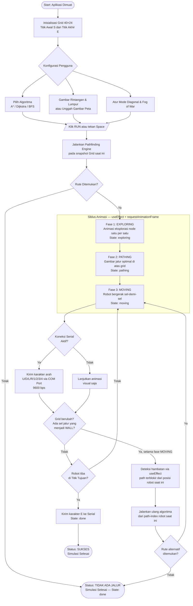
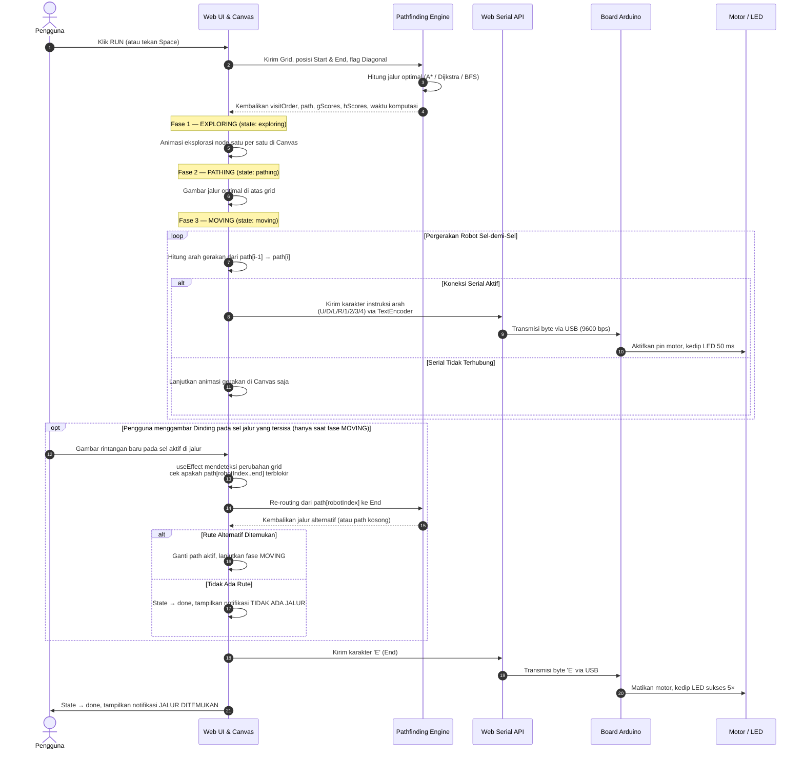
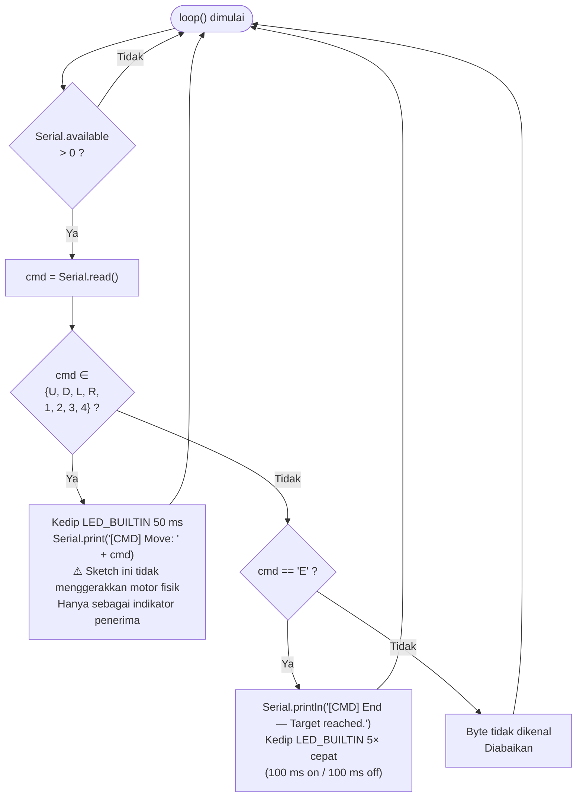

# Robot Navigation Simulation System

> **Mata Kuliah:** Arsitektur Komputer — Ujian Akhir Semester  
> **Deskripsi:** Simulator navigasi robot berbasis web yang memvisualisasikan algoritma _pathfinding_ secara real-time pada peta grid 40×24, serta mengintegrasikan transmisi data gerakan robot ke mikrokontroler Arduino melalui **Web Serial API**.

---

## 🛠️ Tech Stack

<p align="center">
  <a href="https://react.dev/"></a>
  <a href="https://www.typescriptlang.org/"></a>
  <a href="https://vite.dev/"></a>
  <a href="https://tailwindcss.com/"></a>
  <a href="https://www.arduino.cc/"></a>
  <a href="https://developer.mozilla.org/en-US/docs/Web/HTML"></a>
  <a href="https://developer.mozilla.org/en-US/docs/Web/CSS"></a>
</p>

| Kategori               | Teknologi                                        |
| ---------------------- | ------------------------------------------------ |
| **Core Framework**     | React 19 + TypeScript + Vite 6                   |
| **Styling & UI**       | Tailwind CSS v4 + shadcn/ui                      |
| **Rendering**          | HTML5 Canvas API (grid 40×24, animasi real-time) |
| **Hardware Interface** | Web Serial API (komunikasi USB ke Arduino)       |
| **Ikonografi**         | Lucide React                                     |
| **Tipografi**          | Geist Mono + JetBrains Mono                      |

---

## 🚀 Fitur Utama

### 1. Visualisasi Algoritma Pathfinding Real-Time

Tiga algoritma klasik diimplementasikan secara penuh dengan dukungan **gerakan 8-arah (diagonal)** dan state machine animasi empat fase: `idle → exploring → pathing → moving → done`.

| Algoritma    | Heuristik                              | Weighted? |                   Optimal?                   | Data Structure |
| ------------ | -------------------------------------- | :-------: | :------------------------------------------: | -------------- |
| **A\***      | Octile (diagonal) / Manhattan (4-arah) |    ✅     |                      ✅                      | Min-Heap       |
| **Dijkstra** | — (eksplorasi penuh berbasis bobot)    |    ✅     |                      ✅                      | Min-Heap       |
| **BFS**      | — (jumlah langkah, bukan bobot)        |    ❌     | Hanya jika semua edge & sel berbobot seragam | Queue FIFO     |

> **Catatan Implementasi:**
>
> - A\* dan Dijkstra menggunakan Min-Heap (priority queue) sehingga kompleksitas waktu O((V + E) log V). BFS menggunakan antrian FIFO standar dengan kompleksitas O(V + E).
> - Heuristik yang ditampilkan pada panel debug (g/h/f scores) dihitung untuk **seluruh** algoritma — termasuk Dijkstra dan BFS — demi konsistensi UI, meskipun kedua algoritma tersebut **tidak** menggunakan heuristik dalam proses pencarian jalur.
> - **BFS dan Optimalitas:** BFS menjamin jalur terpendek **dalam jumlah langkah (hop count)**, bukan dalam jarak geometris. Saat mode diagonal aktif, biaya langkah diagonal (√2 ≈ 1.414) berbeda dari langkah ortogonal (1.0), sehingga jalur BFS yang optimal dalam hop count **belum tentu optimal secara jarak geometris**. BFS tetap menemukan rute dengan langkah paling sedikit, bukan rute terpendek secara Euclidean.

---

### 2. Interaktivitas Peta Grid (HUD Style)

- Menggambar **Dinding** (tidak dapat dilewati) dan **Lumpur** (bobot: 5).
- Mengubah posisi **Titik Awal (S)** dan **Titik Akhir (E)** secara dinamis.
- Memuat peta preset: **Maze**, **Open Field**, **Bottleneck**.
- **Unggah Gambar Peta**: PNG/JPG dikonversi otomatis menjadi dinding grid (piksel gelap = dinding, piksel terang = jalan).

---

### 3. Dynamic Re-routing (Replanning Dinamis)

Saat robot berada dalam fase **`moving`**, pengguna dapat menggambar dinding baru di atas sel yang tersisa pada jalur aktif. Sistem mendeteksi hambatan melalui `useEffect` yang mengamati perubahan `grid`, kemudian menjalankan ulang algoritma dari **posisi robot saat ini** (`path[Math.floor(robotT)]`) menuju titik akhir — tanpa mereset simulasi.

> **Catatan Implementasi & Perbaikan Visual (Replan):**
>
> - Re-routing hanya aktif selama fase `moving`. Menggambar dinding pada fase `exploring` atau `pathing` tidak memicu replanning; efeknya baru terlihat pada perhitungan berikutnya.
> - **Optimal Path Rendering Fix:** Saat melakukan replan, sistem secara dinamis menginisialisasi parameter `pstep` langsung ke panjang rute aktif yang baru. Hal ini mencegah visualisasi garis rute menghilang (_ghost path_) saat terjadi kalkulasi ulang di tengah pergerakan robot.
> - **Dynamic Goal Redirection Fix:** Apabila titik tujuan (Goal/End) dipindahkan secara dinamis oleh pengguna saat robot dalam fase `moving`, sistem mendeteksi perubahan `endPos` dan langsung melakukan replan rute ke tujuan baru dari posisi robot saat itu tanpa perlu menunggu rintangan menghalangi.

> **Catatan Teknis:** Replanning pada sistem ini menggunakan pendekatan **full recomputation** — algoritma dijalankan ulang dari posisi robot saat ini, bukan pendekatan inkremental seperti D\* (Stentz, 1994) atau D\* Lite (Koenig & Likhachev, 2002) yang mereuse komputasi sebelumnya. Pada grid berukuran 40×24 (960 sel), perbedaan efisiensi tidak signifikan, namun pada peta yang jauh lebih besar, pendekatan inkremental akan lebih efisien.

---

### 4. Mode Fog of War (Eksplorasi Peta Tersembunyi)

Robot menjelajahi grid dalam kondisi peta tersembunyi (_fog of war_) **tanpa mengetahui lokasi tujuan**. Robot mengandalkan sensor LiDAR (radius ±4 sel) untuk menyingkap area secara bertahap, dan harus benar-benar **mencari** tujuan dengan menjelajahi wilayah yang belum dipetakan — bukan bergerak lurus ke titik akhir. Karena itu robot bisa salah arah, menemui jalan buntu, dan melakukan _backtracking_, persis seperti navigasi otonom di lingkungan asing.

> **Arsitektur Eksplorasi (Frontier-Based Exploration):**
>
> - **Conservative World Model:** Seluruh sel yang belum disingkap LiDAR dianggap **dinding (`WALL`)**, bukan jalan kosong. Robot hanya boleh merencanakan rute melalui sel yang sudah benar-benar ia indera. Ini menggantikan _freespace assumption_ lama yang membuat robot bisa "menembak" rute lurus ke tujuan melalui area gelap.
> - **Goal Tidak Diketahui:** Koordinat tujuan (`endPos`) **tidak pernah** diberikan ke pemecah rute sampai sel tujuan tersingkap oleh LiDAR. Sebelum itu, robot memilih **frontier** — sel belum dikenal yang berbatasan dengan area dikenal — sebagai target sementara menggunakan _BFS frontier nearest_ (Yamauchi, 1997). Marker tujuan `E` pada kanvas juga baru muncul setelah disingkap.
> - **Penemuan Tujuan:** Begitu LiDAR menyingkap sel tujuan, robot otomatis beralih dari mode eksplorasi frontier ke mode menuju tujuan dan menghitung rute nyata melalui wilayah yang sudah aman/terungkap.
> - **Kemungkinan Gagal:** Jika seluruh frontier yang terjangkau habis dipetakan tanpa menemukan tujuan (mis. tujuan terkurung dinding), simulasi berakhir dengan status **tidak ditemukan** — robot tidak selalu berhasil dalam sekali percobaan.

> **Catatan Stabilitas & Implementasi:**
>
> - **Reveal Tidak Tembus Pandang:** Sinar LiDAR (`castLidar`) berhenti pada dinding nyata, sehingga sel di balik dinding tetap tersembunyi. Robot tidak dapat "mengintip" area yang terhalang.
> - **Replan Saat Rintangan Disingkap:** Selama fase `moving`, jika LiDAR menyingkap dinding baru pada sisa rute, atau pengguna menggambar dinding pada sel terungkap, sistem menghitung ulang target (frontier atau tujuan) dari posisi robot saat itu. Pengecekan blokir hanya menganggap sel **yang sudah terungkap dan berupa dinding** sebagai penghalang.
> - **Transmisi Serial:** Karakter `E` (End) hanya dikirim ke Arduino ketika robot benar-benar tiba di tujuan, bukan pada setiap akhir leg eksplorasi frontier.
> - **React Ref Safety:** Kontroler eksplorasi dikelola lewat pola `useRef` + `useEffect` untuk menghindari _stale closure_ pada loop animasi.

> **Catatan Terminologi:** Fitur ini menggunakan mekanisme **Fog of War** (istilah dari game _real-time strategy_) dengan **frontier-based exploration**, bukan SLAM (Simultaneous Localization and Mapping) dalam definisi akademis. Dalam SLAM sesungguhnya (Smith, Self & Cheeseman, 1986), robot tidak mengetahui posisinya sendiri dan memperkirakan lokasi secara probabilistik (mis. Extended Kalman Filter / Particle Filter). Pada sistem ini, posisi robot selalu diketahui pasti dan peta dibuka secara biner (terungkap/tersembunyi) tanpa ketidakpastian sensor; yang tidak diketahui robot adalah **lokasi tujuan dan tata letak rintangan**.

---

### 5. Koneksi Serial Arduino (Web Serial API)

Karakter instruksi dikirim ke port USB mikrokontroler **hanya selama fase `moving`** pada kecepatan 9600 bps. Transmisi menggunakan `TextEncoder` untuk konversi string ke `Uint8Array` sebelum ditulis ke serial writer.

> **Catatan Transmisi Sekuensial (Race Condition Fix):** Penulisan karakter arah diimplementasikan secara sekuensial menggunakan fungsi `sendCommandsSequentially` dengan `await` pada penulisan stream. Hal ini mencegah terjadinya tabrakan byte (_interleaving_) saat robot bergerak cepat dan mendatangkan multiple write request secara bersamaan pada stream writer.

| Karakter | Arah                 |
| :------: | -------------------- |
|   `U`    | Atas (Up)            |
|   `D`    | Bawah (Down)         |
|   `L`    | Kiri (Left)          |
|   `R`    | Kanan (Right)        |
|   `1`    | Diagonal Atas-Kiri   |
|   `2`    | Diagonal Atas-Kanan  |
|   `3`    | Diagonal Bawah-Kiri  |
|   `4`    | Diagonal Bawah-Kanan |
|   `E`    | Selesai / End        |

---

### 6. Mode Perbandingan Algoritma

Menjalankan ketiga algoritma (A\*, Dijkstra, BFS) secara bersamaan pada grid yang sama dan menampilkan perbandingan jumlah node yang dieksplorasi, panjang jalur optimal, dan waktu komputasi.

---

### 7. Visualisasi Peta Memori (SRAM/ROM Map)

Menampilkan pemetaan koordinat jalur robot pada rentang alamat memori `0x00`–`0xFF` (ruang alamat 8-bit, 256 byte) untuk melihat alokasi memori fisik pada arsitektur perangkat keras:

- **Alamat `0x00`–`0x01` (2 byte):** Panjang rute (`pathLen`) disimpan dalam format 16-bit little-endian. Nilai ini dibatasi maksimum 127 koordinat.
- **Alamat `0x02`–`0xFF` (254 byte):** Koordinat jalur (2 byte per titik: `row` dan `col`).
- **Batas Fisik:** Karena kapasitas maksimum memori adalah 256 byte, rute yang lebih dari 127 langkah akan mengalami pemotongan (_truncated_). Sistem menyelaraskan nilai panjang jalur agar tidak melebihi 127 koordinat demi menghindari kegagalan _out-of-bounds read_ pada mikrokontroler.

> **Catatan Optimasi Ekspor Kode (SRAM & Hardware Efficiency):**
>
> - **Assembly (`route.asm`):** Menggunakan direktif `DW` (Define Word) alih-alih `DB` (Define Byte) untuk variabel `PATH_LEN` guna mendukung panjang rute $\ge 256$ langkah secara aman tanpa memicu kompiler overflow.
> - **C/Arduino (`route.c`):** Mengintegrasikan header `<avr/pgmspace.h>` dan kata kunci `PROGMEM` pada konstanta rute agar data disimpan dalam memori Flash (ROM) mikrokontroler AVR. Langkah ini mencegah kehabisan kapasitas SRAM dinamis (2 KB pada Arduino Uno) saat memuat rute navigasi yang panjang.

---

### 8. Serial Monitor Console

Terminal terintegrasi untuk mencatat log kalkulasi algoritma, status koneksi COM, dan histori karakter serial yang ditransmisikan. Mendukung **Virtual Serial Emulator** untuk pengujian tanpa perangkat keras fisik (kompatibel dengan Safari dan browser tanpa dukungan Web Serial API).

---

## 🌾 Konsep Weighted Terrain (Sel Berbobot)

Sel **Lumpur (Mud)** mendemonstrasikan konsep _Weighted Graph_ dalam pencarian rute:

| Tipe Sel            |       Bobot (Cost)       |
| ------------------- | :----------------------: |
| Jalan Biasa (Empty) |            1             |
| Lumpur (Mud)        |            5             |
| Dinding (Wall)      | ∞ (tidak dapat dilewati) |

**Formula biaya langkah:**

```
stepCost = directionCost × cellWeight
```

- **Langkah Ortogonal:** `directionCost = 1.0`
- **Langkah Diagonal:** `directionCost = √2 ≈ 1.414`
- **Pencegahan _corner-cutting_ (strict):** Langkah diagonal dari sel (r, c) ke (r+dr, c+dc) diblokir jika **salah satu** sel ortogonal yang bersebelahan — yaitu (r, c+dc) atau (r+dr, c) — berupa dinding. Metode ini mengikuti konvensi _strict corner-cutting prevention_ yang umum dalam literatur robotics, mencegah robot melewati sudut dinding secara tidak realistis.

**Implikasi per Algoritma:**

- **A\* & Dijkstra:** Menghitung biaya kumulatif sesungguhnya. Robot akan memutar melalui jalan biasa jika total bobotnya lebih kecil daripada menerobos sel lumpur (mis. 4 langkah ortogonal dengan total biaya 4 lebih efisien dari 1 langkah lumpur dengan biaya 5).
- **BFS:** Mengabaikan bobot sel — setiap langkah bernilai 1. BFS akan menerobos lumpur jika itu adalah jalur dengan _jumlah langkah_ paling sedikit, mendemonstrasikan perbedaan mendasar antara algoritma berbobot dan tidak berbobot.

---

## 📊 Diagram Sistem & Alur Logika

### 1. System Flowchart — Alur Kerja Aplikasi

Diagram ini memetakan siklus eksekusi penuh, mulai dari inisialisasi hingga robot mencapai titik tujuan. Siklus animasi dibagi menjadi **empat fase** (`exploring → pathing → moving → done`) yang sesuai dengan `SimulationState` pada implementasi. Mekanisme _dynamic replanning_ hanya aktif selama fase `moving` dan hanya dipicu oleh perubahan `grid`.



---

### 2. Sequence Diagram — Alur Komunikasi Antarkomponen

Diagram ini menggambarkan urutan pertukaran pesan dari aksi pengguna hingga ke perangkat keras Arduino. Perlu diperhatikan bahwa **transmisi serial hanya terjadi selama fase `moving`**, bukan selama eksplorasi node atau penggambaran jalur.



---

### 3. Arduino Command Processing — Logika Penerimaan Perintah Serial

Diagram ini merepresentasikan logika pemrosesan perintah pada sketch Arduino penerima. Setiap byte yang masuk diproses langsung tanpa state `RUN/STOP` — Arduino selalu siap menerima perintah sejak `setup()` selesai dijalankan.



---

## ⌨️ Pintasan Keyboard

| Tombol  | Aksi                                                 |
| :-----: | ---------------------------------------------------- |
| `Space` | Jalankan simulasi penuh (Start → End)                |
|   `S`   | Jalankan simulasi langkah-demi-langkah (_step mode_) |
|   `R`   | Reset robot & visualisasi pencarian                  |
|   `C`   | Bersihkan seluruh rintangan dan lumpur dari grid     |
|   `1`   | Pilih alat: Dinding (Wall)                           |
|   `2`   | Pilih alat: Titik Awal (Start)                       |
|   `3`   | Pilih alat: Titik Tujuan (End)                       |
|   `4`   | Pilih alat: Penghapus (Eraser)                       |
|   `5`   | Pilih alat: Lumpur (Mud)                             |

---

## 🔌 Kode Arduino (Receiver Sketch)

Unggah sketch berikut ke Arduino (Uno/Nano/Mega) menggunakan **Arduino IDE** sebelum menghubungkan perangkat melalui tombol **Hubungkan Serial** di panel aplikasi.

> **Protokol Framed Serial:** Setiap perintah dikirim dalam bingkai 4-byte: `[STX=0x02][CMD][CHECKSUM][ETX=0x03]`. Checksum = `CMD XOR 0xFF`. Arduino memvalidasi bingkai sebelum mengeksekusi perintah dan mengirim kembali frame ACK `[0x02][0x06][0xF9][0x03]` sebagai konfirmasi penerimaan.

```cpp
// ─────────────────────────────────────────────────────────────
//  Robot Navigation Receiver — Framed Serial Protocol
//  Frame Format: [STX=0x02][CMD][CHECKSUM][ETX=0x03]
//  Checksum: CMD XOR 0xFF (bitwise NOT)
//  ACK Response: [STX][0x06][0xF9][ETX]
//  Commands: U(Up), D(Down), L(Left), R(Right),
//            1–4 (Diagonal), E(End/Selesai)
//  Baud Rate: 9600 bps
// ─────────────────────────────────────────────────────────────

const byte STX = 0x02;  // Start of Text — frame delimiter
const byte ETX = 0x03;  // End of Text — frame delimiter
const byte ACK = 0x06;  // Acknowledge — positive response

const int LED_PIN = LED_BUILTIN; // Pin 13 pada sebagian besar board

void setup() {
  Serial.begin(9600);
  pinMode(LED_PIN, OUTPUT);
  digitalWrite(LED_PIN, LOW);
  Serial.println("[SYSTEM] Arduino Ready. Framed protocol active.");
}

// Kirim frame ACK ke master (web app)
void sendAck() {
  byte frame[4] = { STX, ACK, (byte)(ACK ^ 0xFF), ETX };
  Serial.write(frame, 4);
}

void loop() {
  if (Serial.available() >= 4) {
    byte startByte = Serial.read();
    if (startByte != STX) return; // bukan awal frame

    byte cmd = Serial.read();
    byte checksum = Serial.read();
    byte endByte = Serial.read();

    // Validasi struktur frame
    if (endByte != ETX) return;
    if (checksum != (cmd ^ 0xFF)) {
      Serial.println("[ERR] Checksum mismatch. Frame discarded.");
      return;
    }

    if (cmd == 'U' || cmd == 'D' || cmd == 'L' || cmd == 'R' ||
        cmd == '1' || cmd == '2' || cmd == '3' || cmd == '4') {
      // Indikator gerak: kedip singkat 50 ms + ACK
      digitalWrite(LED_PIN, HIGH);
      delay(50);
      digitalWrite(LED_PIN, LOW);
      Serial.print("[CMD] Move: ");
      Serial.println((char)cmd);
      sendAck();

    } else if (cmd == 'E') {
      // Indikator sukses: kedip 5× cepat + ACK
      Serial.println("[CMD] End — Target reached.");
      for (int i = 0; i < 5; i++) {
        digitalWrite(LED_PIN, HIGH);
        delay(100);
        digitalWrite(LED_PIN, LOW);
        delay(100);
      }
      sendAck();
    }
  }
}
```

---

## 🛠️ Panduan Instalasi & Menjalankan Secara Lokal

**Prasyarat:** [Node.js](https://nodejs.org/) v18 atau lebih baru.

```bash
# 1. Kloning repositori
git clone <url-repositori>
cd uas-arkom

# 2. Pasang seluruh dependensi
npm install

# 3. Jalankan server pengembangan
npm run dev
```

Buka URL localhost yang muncul di terminal (contoh: `http://localhost:5173`).

---

## ⚠️ Kompatibilitas Browser

| Browser            | Web Serial (Fisik) | Emulator (Virtual) | Keterangan                            |
| ------------------ | :----------------: | :----------------: | ------------------------------------- |
| Google Chrome 89+  |         ✅         |         ✅         | Didukung penuh                        |
| Microsoft Edge 89+ |         ✅         |         ✅         | Didukung penuh                        |
| Firefox 151+       |         ✅         |         ✅         | Didukung penuh (Fisik & Virtual)      |
| Safari             |         ❌         |         ✅         | Hanya melalui Virtual Serial Emulator |

> **Catatan:** Web Serial API memerlukan konteks yang aman (HTTPS atau `localhost`). Koneksi fisik ke Arduino membutuhkan interaksi pengguna (klik tombol) sebelum browser mengizinkan akses port.
