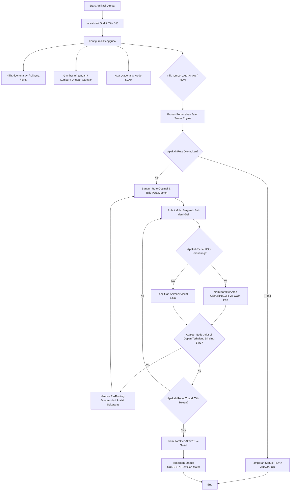
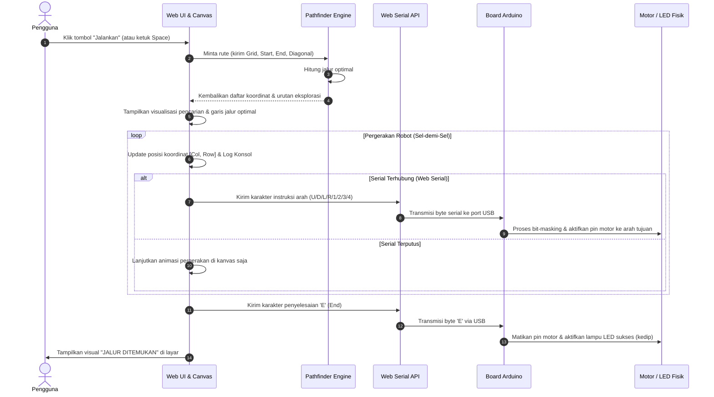

# Simulation Robot Navigation System (UAS Arsitektur Komputer)

Aplikasi simulator sistem navigasi robot berbasis web interaktif. Proyek ini memvisualisasikan algoritma pencarian jalur (*pathfinding*) populer (**A***, **Dijkstra**, dan **BFS**) di atas peta grid, serta mengintegrasikan data pergerakan robot secara langsung (*real-time streaming*) ke mikrokontroler Arduino menggunakan **Web Serial API**.

Aplikasi ini didesain khusus untuk memenuhi praktikum/ujian praktis mata kuliah **Arsitektur Komputer (Arkom)**, menunjukkan bagaimana data logika rute memori perangkat lunak dikirimkan dan diproses oleh arsitektur perangkat keras secara fisik.

---

## 🚀 Fitur Utama

1. **Visualisasi Pencarian Jalur Waktu-Nyata**:
   - **A* (A-Star)**: Algoritma pencarian terpimpin menggunakan heuristik jarak Manhattan/Octile untuk efisiensi maksimal.
   - **Dijkstra**: Menjamin rute terpendek dengan menjelajahi area secara merata berdasarkan bobot sel.
   - **BFS (Breadth-First Search)**: Menjelajahi seluruh node tetangga secara bertahap pada graf tanpa bobot.
2. **Interaktivitas Peta Grid (HUD Style)**:
   - Menggambar rintangan **Dinding** dan jalan berbobot **Lumpur (bobot: 5)**.
   - Mengubah letak Titik Awal (**S**) dan Titik Akhir (**E**) secara dinamis (klik & seret).
   - Memuat berbagai peta preset (*Maze, Open Field, Bottleneck*).
   - **Unggah Gambar Peta**: Unggah berkas PNG/JPG untuk otomatis diubah menjadi dinding grid (Gelap = Dinding, Terang = Jalan).
3. **Mode Sensor SLAM (Sensor Fog of War)**:
   - Robot menjelajahi labirin dalam kabut sensor. Peta grid hanya akan terungkap secara dinamis melalui sapuan visual sensor LiDAR.
4. **Koneksi Serial Mikrokontroler (Arduino)**:
   - Mengirim karakter perintah gerak robot (`U`, `D`, `L`, `R` untuk arah utama, `1`, `2`, `3`, `4` untuk diagonal, dan `E` untuk sukses/selesai) secara langsung ke port COM mikrokontroler.
5. **Visual Peta Memori (SRAM/ROM Map)**:
   - Menampilkan visualisasi penempatan byte koordinat rute lintasan robot pada sel alamat memori 0x00 hingga 0xFF secara langsung saat rute berhasil dibangun.
6. **Konsol Monitor Log Serial**:
   - Terminal terintegrasi yang mencatat aktivitas kalkulasi algoritma, status sambungan COM, dan histori karakter byte data arah yang dikirimkan.

---

## 📊 Diagram Sistem & Alur Logika

Berikut adalah representasi visual dari alur kerja aplikasi dan komunikasi data antarkomponen.

### 1. Flowchart Alur Kerja Sistem (System Flowchart)

Menggambarkan alur eksekusi aplikasi dari inisialisasi hingga robot sampai ke koordinat tujuan:



### 2. Diagram Tangga Pesan (Sequence Diagram)

Menggambarkan urutan pengiriman pesan dan instruksi komunikasi dari aksi pengguna hingga ke tingkat perangkat keras:



### 3. Diagram Tangga Logika Kendali (PLC Ladder Diagram)

Menggambarkan logika kelistrikan/relay mikrokontroler Arduino dalam memproses sinyal masukan data serial untuk menggerakkan motor robot secara aman:

```text
  Rung 1 (Sistem Run / Aktivasi Gerakan):
  +----------------------------------------------------------------------+
  |                                                                      |
  |   START_CMD       STOP_CMD                                [ RUN ]    |
  |------| |-------------|/|------------------------------------( )------|
  |       RUN                                                            |
  |------| |------+                                                      |
  |                                                                      |
  +----------------------------------------------------------------------+

  Rung 2 (Instruksi Arah Motor Utama):
  +----------------------------------------------------------------------+
  |                                                                      |
  |      RUN         BYTE == 'U'                              MOTOR_UP   |
  |------| |-------------| |------------------------------------( )------|
  |                                                                      |
  |      RUN         BYTE == 'D'                             MOTOR_DOWN  |
  |------| |-------------| |------------------------------------( )------|
  |                                                                      |
  |      RUN         BYTE == 'L'                             MOTOR_LEFT  |
  |------| |-------------| |------------------------------------( )------|
  |                                                                      |
  |      RUN         BYTE == 'R'                             MOTOR_RIGHT |
  |------| |-------------| |------------------------------------( )------|
  |                                                                      |
  +----------------------------------------------------------------------+

  Rung 3 (Instruksi Berhenti & Indikator LED Sukses):
  +----------------------------------------------------------------------+
  |                                                                      |
  |    BYTE == 'E'                                            [RESET]    |
  |------| |----------------------------------------------------(R) RUN  |
  |                                                                      |
  |    BYTE == 'E'                                            LED_READY  |
  |------| |----------------------------------------------------(S) LED  |
  |                                                                      |
  +----------------------------------------------------------------------+
```

---

## ⌨️ Pintasan Keyboard (Shortcuts)

Untuk mengoperasikan simulator dengan cepat, Anda dapat menggunakan tombol-tombol keyboard berikut:

| Tombol | Aksi |
| :---: | --- |
| `Space` | Menjalankan simulasi secara langsung dari titik Awal ke Tujuan |
| `S` | Menjalankan simulasi langkah-demi-langkah (*step solver*) |
| `R` | Mengatur ulang (*reset*) robot dan visualisasi pencarian |
| `C` | Membersihkan (*clear*) grid dari seluruh rintangan & lumpur |
| `1` | Memilih alat gambar: **Dinding** |
| `2` | Memilih alat gambar: **Titik Mulai (S)** |
| `3` | Memilih alat gambar: **Titik Tujuan (E)** |
| `4` | Memilih alat gambar: **Hapus (Eraser)** |
| `5` | Memilih alat gambar: **Lumpur (Mud)** |

---

## 🔌 Mengunggah Kode Penerima ke Arduino

Salin kode C++ berikut ke **Arduino IDE** Anda dan unggah ke modul Arduino (Uno/Nano/Mega/dll) sebelum menghubungkannya melalui tombol **Hubungkan Serial** pada panel kanan web.

```cpp
// ── Arduino Live Receiver Sketch ──
// Menerima data serial: U(Up), D(Down), L(Left), R(Right), E(End)

const int LED_PIN = LED_BUILTIN; // Pin LED bawaan (biasanya 13)

void setup() {
  // Inisialisasi komunikasi serial pada Baud Rate 9600 bps
  Serial.begin(9600);
  
  // Set pin LED sebagai OUTPUT
  pinMode(LED_PIN, OUTPUT);
  digitalWrite(LED_PIN, LOW);
  
  // Log inisiasi sistem sukses
  Serial.println("ARDUINO: System Ready.");
}

void loop() {
  // Memeriksa ketersediaan data pada buffer serial
  if (Serial.available() > 0) {
    char cmd = Serial.read(); // Membaca karakter byte data
    
    // Logika respon berdasarkan karakter gerak
    if (cmd == 'U' || cmd == 'D' || cmd == 'L' || cmd == 'R' ||
        cmd == '1' || cmd == '2' || cmd == '3' || cmd == '4') {
      
      // Indikator aktif: LED menyala saat menerima instruksi gerak
      digitalWrite(LED_PIN, HIGH);
      delay(50); // Delay kedip singkat
      digitalWrite(LED_PIN, LOW);
      
    } else if (cmd == 'E') {
      // Indikator sukses: Berkedip 5 kali dengan cepat saat robot tiba
      for (int i = 0; i < 5; i++) {
        digitalWrite(LED_PIN, HIGH);
        delay(100);
        digitalWrite(LED_PIN, LOW);
        delay(100);
      }
    }
  }
}
```

---

## 🛠️ Panduan Instalasi & Menjalankan Lokal

Pastikan Anda telah memasang [Node.js](https://nodejs.org/) di sistem Anda.

1. **Kloning atau Unduh Repositori**:
   ```bash
   git clone <url-repository-anda>
   cd uas-arkom
   ```
2. **Pasang Dependensi**:
   ```bash
   npm install
   ```
3. **Jalankan Server Pengembangan**:
   ```bash
   npm run dev
   ```
4. **Buka Aplikasi**:
   - Salin dan buka alamat localhost yang muncul di terminal (contoh: `http://localhost:5173`) pada peramban Chrome atau Edge (diperlukan untuk dukungan Web Serial API).
