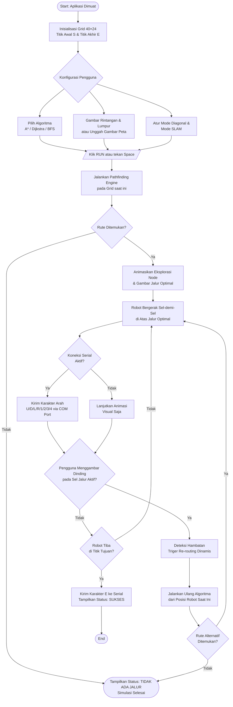
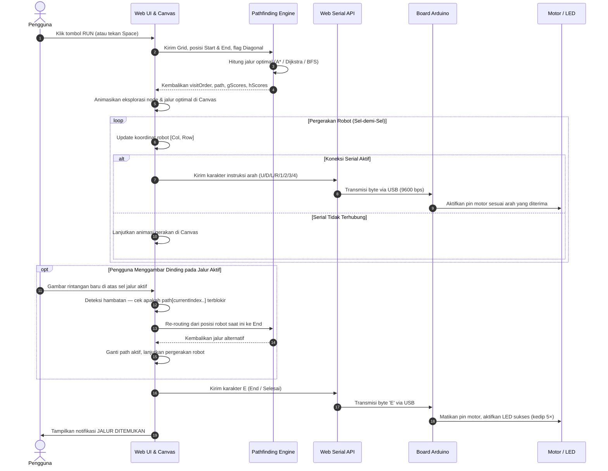
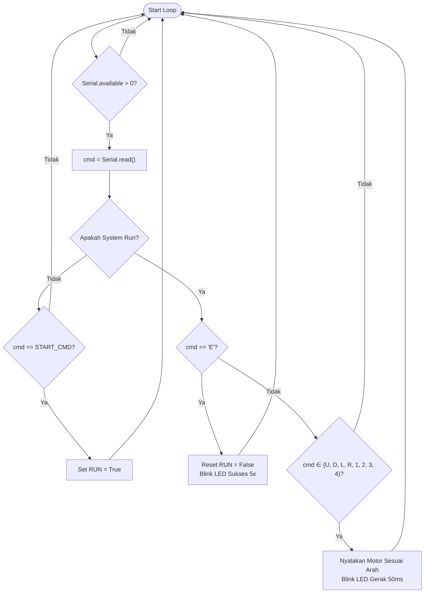

# Robot Navigation Simulation System

> **Mata Kuliah:** Arsitektur Komputer (UAS)  
> **Deskripsi:** Simulator interaktif berbasis web yang memvisualisasikan algoritma _pathfinding_ pada peta grid dan mengintegrasikan komunikasi data gerakan robot secara _real-time_ ke mikrokontroler Arduino melalui **Web Serial API**.

---

## 🛠️ Tech Stack

<p align="left">
  <a href="https://react.dev/"></a>
  <a href="https://www.typescriptlang.org/"></a>
  <a href="https://vite.dev/"></a>
  <a href="https://tailwindcss.com/"></a>
  <a href="https://www.arduino.cc/"></a>
  <a href="https://developer.mozilla.org/en-US/docs/Web/HTML"></a>
  <a href="https://developer.mozilla.org/en-US/docs/Web/CSS"></a>
</p>

| Kategori               | Teknologi                                        |
| ---------------------- | ------------------------------------------------ |
| **Core Framework**     | React 19 + TypeScript + Vite 6                   |
| **Styling & UI**       | Tailwind CSS v4 + shadcn/ui                      |
| **Rendering**          | HTML5 Canvas API (grid 40×24, animasi real-time) |
| **Hardware Interface** | Web Serial API (komunikasi USB ke Arduino)       |
| **Ikonografi**         | Lucide React                                     |
| **Tipografi**          | Geist Mono + JetBrains Mono                      |

---

## 🚀 Fitur Utama

### 1. Visualisasi Algoritma Pathfinding Real-Time

Tiga algoritma klasik diimplementasikan secara penuh dengan dukungan **gerakan 8-arah (diagonal)**:

| Algoritma    | Heuristik                              | Weighted? | Optimal?                    |
| ------------ | -------------------------------------- | --------- | --------------------------- |
| **A\***      | Octile (diagonal) / Manhattan (4-arah) | ✅ Ya     | ✅ Ya                       |
| **Dijkstra** | — (eksplorasi penuh berbasis bobot)    | ✅ Ya     | ✅ Ya                       |
| **BFS**      | — (jumlah langkah, bukan bobot)        | ❌ Tidak  | Hanya jika semua bobot sama |

> **Catatan Implementasi:** A\* dan Dijkstra menggunakan _Min-Heap_ (priority queue) untuk efisiensi O((V + E) log V). BFS menggunakan antrian FIFO standar.

### 2. Interaktivitas Peta Grid (HUD Style)

- Menggambar **Dinding** (tidak dapat dilewati) dan **Lumpur** (bobot: 5).
- Mengubah posisi **Titik Awal (S)** dan **Titik Akhir (E)** secara dinamis.
- Memuat peta _preset_: Maze, Open Field, Bottleneck.
- **Unggah Gambar Peta**: PNG/JPG dikonversi otomatis menjadi dinding grid (piksel gelap = dinding, piksel terang = jalan).

### 3. Dynamic Re-routing (Rute Ulang Dinamis)

Saat simulasi berjalan, pengguna dapat **menggambar dinding baru** di atas sel yang berada pada jalur aktif robot. Sistem akan secara otomatis mendeteksi hambatan dan menjalankan ulang algoritma dari **posisi robot saat ini** untuk menemukan rute alternatif—tanpa harus me-reset simulasi.

### 4. Mode SLAM (Sensor Fog of War)

Robot menjelajahi grid dalam kondisi peta tersembunyi (_fog of war_). Area grid hanya terungkap secara bertahap melalui sapuan visual sensor LiDAR, mensimulasikan kondisi navigasi otonom di lingkungan yang belum dikenal.

### 5. Koneksi Serial Arduino (Web Serial API)

Mengirimkan instruksi gerakan robot secara _real-time_ ke port USB mikrokontroler. Karakter yang dikirim:

| Karakter | Arah                 |
| :------: | -------------------- |
|   `U`    | Atas (Up)            |
|   `D`    | Bawah (Down)         |
|   `L`    | Kiri (Left)          |
|   `R`    | Kanan (Right)        |
|   `1`    | Diagonal Atas-Kiri   |
|   `2`    | Diagonal Atas-Kanan  |
|   `3`    | Diagonal Bawah-Kiri  |
|   `4`    | Diagonal Bawah-Kanan |
|   `E`    | Selesai / End        |

### 6. Visualisasi Peta Memori (SRAM/ROM Map)

Menampilkan pemetaan koordinat jalur robot pada alamat memori `0x00`–`0xFF`, memperlihatkan representasi data rute dalam konteks arsitektur memori perangkat keras.

### 7. Serial Monitor Console

Terminal terintegrasi untuk mencatat log kalkulasi algoritma, status koneksi COM, dan histori karakter serial yang dikirimkan.

---

## 🌾 Konsep Weighted Terrain (Sel Berbobot)

Sel **Lumpur (Mud)** mendemonstrasikan konsep _Weighted Graph_ dalam pencarian rute:

| Tipe Sel            |       Bobot (Cost)       |
| ------------------- | :----------------------: |
| Jalan Biasa (Empty) |            1             |
| Lumpur (Mud)        |            5             |
| Dinding (Wall)      | ∞ (tidak dapat dilewati) |

**Formula biaya langkah:**

```
Cost = Direction Cost × Cell Weight
```

- **Langkah Ortogonal:** Direction Cost = 1.0
- **Langkah Diagonal:** Direction Cost = √2 ≈ 1.414

**Implikasi per Algoritma:**

- **A\* & Dijkstra**: Menghitung biaya kumulatif sesungguhnya. Robot akan memutar melalui jalan biasa jika total bobotnya lebih kecil dari melewati sel lumpur. Contoh: memutar 4 langkah (total biaya ≤ 4) lebih efisien daripada menerobos 1 sel lumpur (biaya = 5).
- **BFS**: Mengabaikan bobot sel—setiap langkah dianggap bernilai 1. BFS akan menerobos lumpur jika itu adalah jalur dengan _jumlah langkah_ paling sedikit, mendemonstrasikan perbedaan mendasar antara algoritma berbobot dan tidak berbobot.

---

## 📊 Diagram Sistem & Alur Logika

### 1. System Flowchart — Alur Kerja Aplikasi

Menggambarkan alur eksekusi dari inisialisasi hingga robot mencapai titik tujuan, termasuk mekanisme _dynamic re-routing_ saat pengguna menambahkan rintangan baru secara interaktif.



---

### 2. Sequence Diagram — Alur Komunikasi Antarkomponen

Menggambarkan urutan pertukaran pesan dari aksi pengguna hingga ke level perangkat keras Arduino, termasuk skenario re-routing dinamis.



---

### 3. PLC Ladder Diagram — Logika Kendali Arduino

Representasi logika relay mikrokontroler Arduino dalam memproses byte serial untuk menggerakkan motor robot secara aman dan terstruktur.



---

## ⌨️ Pintasan Keyboard

| Tombol  | Aksi                                                 |
| :-----: | ---------------------------------------------------- |
| `Space` | Jalankan simulasi penuh (Start → End)                |
|   `S`   | Jalankan simulasi langkah-demi-langkah (_step mode_) |
|   `R`   | Reset robot & visualisasi pencarian                  |
|   `C`   | Bersihkan seluruh rintangan dan lumpur dari grid     |
|   `1`   | Pilih alat: **Dinding (Wall)**                       |
|   `2`   | Pilih alat: **Titik Awal (Start)**                   |
|   `3`   | Pilih alat: **Titik Tujuan (End)**                   |
|   `4`   | Pilih alat: **Penghapus (Eraser)**                   |
|   `5`   | Pilih alat: **Lumpur (Mud)**                         |

---

## 🔌 Kode Arduino (Receiver Sketch)

Unggah sketch berikut ke Arduino (Uno/Nano/Mega) menggunakan **Arduino IDE** sebelum menghubungkan perangkat melalui tombol **Hubungkan Serial** di panel aplikasi.

```cpp
// ─────────────────────────────────────────────────────────────
//  Robot Navigation Receiver — Arduino Sketch
//  Protokol: U(Up), D(Down), L(Left), R(Right),
//            1–4 (Diagonal), E(End/Selesai)
//  Baud Rate: 9600 bps
// ─────────────────────────────────────────────────────────────

const int LED_PIN = LED_BUILTIN; // Pin 13 pada sebagian besar board

void setup() {
  Serial.begin(9600);
  pinMode(LED_PIN, OUTPUT);
  digitalWrite(LED_PIN, LOW);
  Serial.println("[SYSTEM] Arduino Ready. Awaiting commands...");
}

void loop() {
  if (Serial.available() > 0) {
    char cmd = Serial.read();

    if (cmd == 'U' || cmd == 'D' || cmd == 'L' || cmd == 'R' ||
        cmd == '1' || cmd == '2' || cmd == '3' || cmd == '4') {
      // Indikator gerak: kedip singkat 50ms
      digitalWrite(LED_PIN, HIGH);
      delay(50);
      digitalWrite(LED_PIN, LOW);
      Serial.print("[CMD] Move: ");
      Serial.println(cmd);

    } else if (cmd == 'E') {
      // Indikator sukses: kedip 5× cepat
      Serial.println("[CMD] End — Target reached.");
      for (int i = 0; i < 5; i++) {
        digitalWrite(LED_PIN, HIGH);
        delay(100);
        digitalWrite(LED_PIN, LOW);
        delay(100);
      }
    }
  }
}
```

---

## 🛠️ Panduan Instalasi & Menjalankan Secara Lokal

**Prasyarat:** [Node.js](https://nodejs.org/) v18 atau lebih baru.

```bash
# 1. Kloning repositori
git clone <url-repositori>
cd uas-arkom

# 2. Pasang seluruh dependensi
npm install

# 3. Jalankan server pengembangan
npm run dev
```

Buka URL localhost yang muncul di terminal (contoh: `http://localhost:5173`). Browser berbasis Chromium (seperti Google Chrome atau Microsoft Edge) serta Firefox 151+ disarankan untuk koneksi fisik langsung ke perangkat keras Arduino. Browser lain seperti Safari didukung penuh melalui **Mode Emulator Serial (Virtual)** yang disematkan langsung di dalam sistem untuk menyimulasikan data gerakan robot.

---

## ⚠️ Kompatibilitas Browser

| Browser            | Web Serial (Fisik) | Emulator (Virtual) | Keterangan |
| ------------------ | :----------------: | :----------------: | ---------- |
| Google Chrome 89+  |         ✅         |         ✅         | Didukung penuh |
| Microsoft Edge 89+ |         ✅         |         ✅         | Didukung penuh |
| Firefox 151+       |         ✅         |         ✅         | Didukung penuh (Fisik & Virtual) |
| Safari             |         ❌         |         ✅         | Didukung menggunakan Emulator Serial Virtual |
